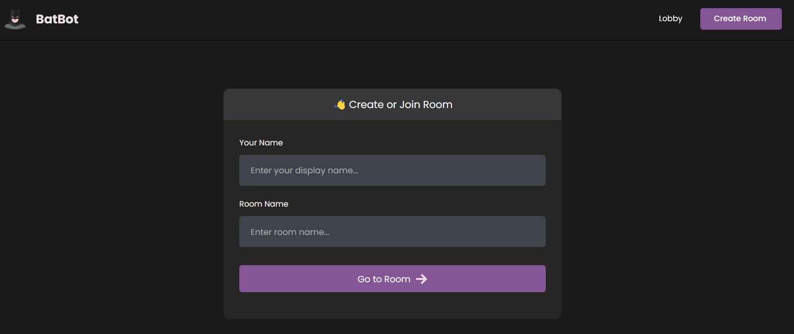
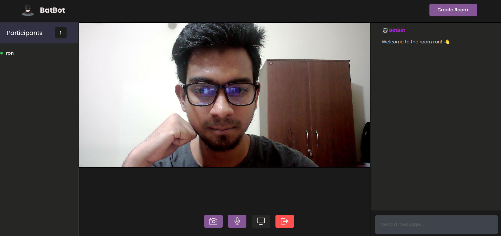

You can visit and experience it ->https://rownok35.github.io/BatBot-Video-Calling-/

A real time messaging & video calling. 


# Installation
* 1 - Create an account on agora.io and create an app to generate an APP ID
* 2 - Update APP ID, Temp Token and Channel Name in room_rtc.js
```javascript
let APP_ID = "YOU-APP-ID"
```

# Features
* 1 - Video Call
* 2 - Live Chat
* 3 - Screen Sharing 
* 4 - Multiple User join


# Lobby Page 
 

# Room Page 
 
 